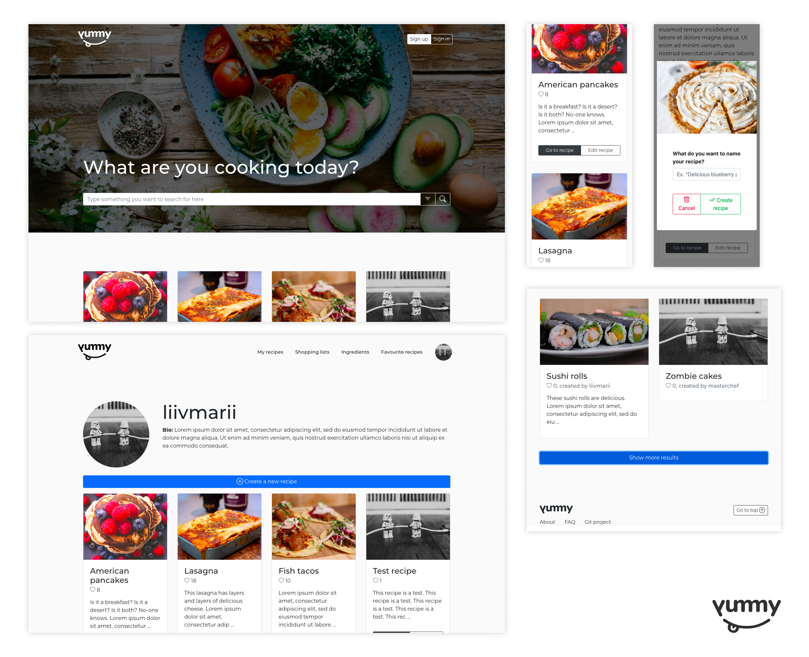

# Backend and Frontend Template

Latest version: https://git.ita.chalmers.se/courses/dit341/group-00-web (public Github [mirror](https://github.com/dit341/group-00-web))

## Project Structure

| File        | Purpose           | What you do?  |
| ------------- | ------------- | ----- |
| `server/` | Backend server code | All your server code |
| [server/README.md](server/README.md) | Everything about the server | **READ ME** carefully! |
| `client/` | Frontend client code | All your client code |
| [client/README.md](client/README.md) | Everything about the client | **READ ME** carefully! |
| [docs/DEPLOYMENT.md](docs/DEPLOYMENT.md) | Free online production deployment | Deploy your app online in production mode |
| [docs/LOCAL_DEPLOYMENT.md](docs/LOCAL_DEPLOYMENT.md) | Local production deployment | Deploy your app local in production mode |

## Requirements

The version numbers in brackets indicate the tested versions but feel free to use more recent versions.
You can also use alternative tools if you know how to configure them (e.g., Firefox instead of Chrome).

* [Git](https://git-scm.com/) (v2) => [installation instructions](https://www.atlassian.com/git/tutorials/install-git)
  * [Add your Git username and set your email](https://docs.gitlab.com/ce/gitlab-basics/start-using-git.html#add-your-git-username-and-set-your-email)
    * `git config --global user.name "YOUR_USERNAME"` => check `git config --global user.name`
    * `git config --global user.email "email@example.com"` => check `git config --global user.email`
  * > **Windows users**: We recommend to use the [Git Bash](https://www.atlassian.com/git/tutorials/git-bash) shell from your Git installation or the Bash shell from the [Windows Subsystem for Linux](https://docs.microsoft.com/en-us/windows/wsl/install-win10) to run all shell commands for this project.
* [Chalmers GitLab](https://git.ita.chalmers.se/) => Login with your **Chalmers CID** choosing "Sign in with" **Chalmers Login**. (contact [support@chalmers.se](mailto:support@chalmers.se) if you don't have one)
  * DIT341 course group: https://git.ita.chalmers.se/courses/dit341
  * [Setup SSH key with Gitlab](https://docs.gitlab.com/ee/ssh/)
    * Create an SSH key pair `ssh-keygen -t ed25519 -C "email@example.com"` (skip if you already have one)
    * Add your public SSH key to your Gitlab profile under https://git.ita.chalmers.se/profile/keys
    * Make sure the email you use to commit is registered under https://git.ita.chalmers.se/profile/emails
  * Checkout the [Backend-Frontend](https://git.ita.chalmers.se/courses/dit341/group-00-web) template `git clone git@git.ita.chalmers.se:courses/dit341/group-00-web.git`
* [Server Requirements](./server/README.md#Requirements)
* [Client Requirements](./client/README.md#Requirements)

## Getting started

```bash
# Clone repository
git clone git@git.ita.chalmers.se:courses/dit341/group-00-web.git

# Change into the directory
cd group-00-web

# Setup backend
cd server && npm install
npm run dev

# Setup frontend
cd client && npm install
npm run serve

# Setup app concurrently
npm run setup (same as npm install, but for both server and client concurrently)
npm run fix (runs npm audit fix on both server and client concurrently)
npm run start (starts server and client concurrently)
```

> Check out the detailed instructions for [backend](./server/README.md) and [frontend](./client/README.md).

## Visual Studio Code (VSCode)

Open the `server` and `client` in separate VSCode workspaces or open the combined [backend-frontend.code-workspace](./backend-frontend.code-workspace). Otherwise, workspace-specific settings don't work properly.

## System Definition (MS0)

### Purpose

Yummy is a social media platform for recipes and ingredients, with user driven content. The functionalities of this platform can be accessed through a MEVN web application, where the end-user can create, change, and share ingredients and recipes, as well as create and update shopping lists to help with their baking and cooking.

The goals of the end-users of this system are to get inspiration for what to eat - by viewing recipes posted by other users, as well as storing, maintaining, and sharing their own favourite recipes.


### Pages
#### Landing page
| Content | Function |
| ------ | ------ |
| Header | App logo, clickable link to landing page (same for all headers). Profile picture avatar, clickable link to own user profile page. |
| Search form | Text input field for search text, button to expand filter options, button to search. |
| Search results | Results from search form input, defaults to newest recipes. Displays 6 recipes by default. Button to expand and load more results. |
| Footer | Same for all footers: (App logo, clickable link to landing page. Link list: 'About', 'Q&A', 'Git project'. 'To top' button). |

#### Profile page (own)
| Content | Function |
| ------ | ------ |
| Header | App logo, clickable link to landing page (same for all headers). Link list (changes search results on profile page): 'My recipes' page, 'My ingredients' page, 'My shopping lists' page, 'Favourite recipes' page. |
| Profile info | Profile photo. Heading: username. Subheading: (not decided yet, ideas?) |
| Create new button | Button to create new [recipe/ingredient/shopping list]. |
| Search form | Text input field for search text, button to expand filter options, button to search. |
| Search results | List of all users [recipes/ingredients/shopping lists]. |
| Footer | Same for all footers: (App logo, clickable link to landing page. Link list: 'About', 'Q&A', 'Git project'. 'To top' button). |

#### Profile page (others)
| Content | Function |
| ------ | ------ |
| Header | App logo, clickable link to landing page (same for all headers). Profile picture avatar, clickable link to own user profile page. |
| Profile info | Profile photo. Heading: username. Subheading: (not decided yet, ideas?) |
| Search form | Text input field for search text, button to expand filter options, button to search. |
| Search results | List of all users recipes. |
| Footer | Same for all footers: (App logo, clickable link to landing page. Link list: 'About', 'Q&A', 'Git project'. 'To top' button). |

#### User settings page
TODO: Idk what we need to put here, need to match user schema.

| Content | Function |
| ------ | ------ |
|  |  |

#### Recipes page
TODO: This page hasn't been wireframed in figma yet, content structure to be filled in.

| Content | Function |
| ------ | ------ |
| Header | App logo, clickable link to landing page (same for all headers). Profile picture avatar, clickable link to own user profile page. |
| Footer | Same for all footers: (App logo, clickable link to landing page. Link list: 'About', 'Q&A', 'Git project'. 'To top' button). |

#### Ingredient page
TODO: This page hasn't been wireframed in figma yet, content structure to be filled in.

| Content | Function |
| ------ | ------ |
| Header | App logo, clickable link to landing page (same for all headers). Profile picture avatar, clickable link to own user profile page. |
| Footer | Same for all footers: (App logo, clickable link to landing page. Link list: 'About', 'Q&A', 'Git project'. 'To top' button). |

#### Shopping list page
TODO: This page hasn't been wireframed in figma yet, content structure to be filled in.

| Content | Function |
| ------ | ------ |
| Header | App logo, clickable link to landing page (same for all headers). Profile picture avatar, clickable link to own user profile page. |
| Footer | Same for all footers: (App logo, clickable link to landing page. Link list: 'About', 'Q&A', 'Git project'. 'To top' button). |

#### Create new [recipe, ingredient, shopping list]
| Content | Function |
| ------ | ------ |
| Header | App logo, clickable link to landing page (same for all headers). Profile picture avatar, clickable link to own user profile page. |
| Form | Form with input fields related to [recipe, ingredient, shoppinglist] creation, as well as 'clear' and 'create' buttons. |
| Footer | Same for all footers: (App logo, clickable link to landing page. Link list: 'About', 'Q&A', 'Git project'. 'To top' button). |

#### About web app page
| Content | Function |
| ------ | ------ |
| Header | App logo, clickable link to landing page (same for all headers). Profile picture avatar, clickable link to own user profile page. |
| About web app section | Heading. Paragraphs about what this web app is and what it does. |
| About the developers section | Heading. Paragraphs about the course and why we're building the app. Cards with the developers, card heading and short card text. |
| Footer | Same for all footers: (App logo, clickable link to landing page. Link list: 'About', 'Q&A', 'Git project'. 'To top' button). |

#### Web app Q&A page
| Content | Function |
| ------ | ------ |
| Header | App logo, clickable link to landing page (same for all headers). Profile picture avatar, clickable link to own user profile page. |
| Table of Q&A | List/table items with frequently asked questions, help for how to use the web app. |
| Footer | Same for all footers: (App logo, clickable link to landing page. Link list: 'About', 'Q&A', 'Git project'. 'To top' button). |

### Entity-Relationship (ER) Diagram


## Teaser (MS3)


